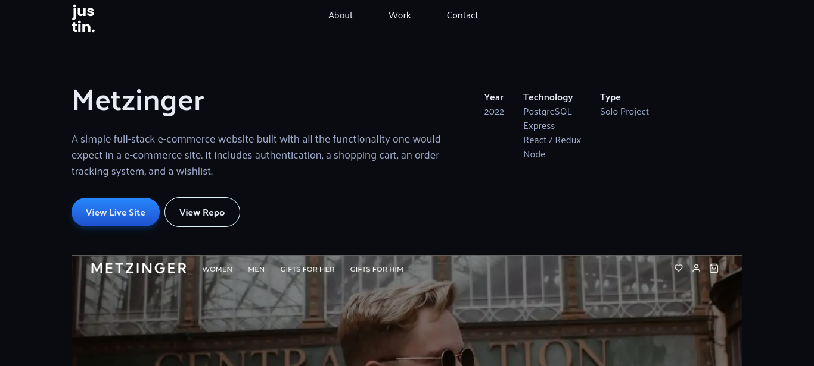

<div id="top" />


<h2 align="center"><a href="https://justinvirella.com">Click to View Site</a></h2>

This is my current portfolio page. Just a simple site built with HTML, Sass, and JavaScript.

### Table of Contents

- [About the Project](#about)
  - [Technologies](#technologies))
- [Screenshots](#screenshots)
- [Getting Started](#getting_started)
  - [Installation](#installation)
- [Contributing](#contributing)
- [License](#license)

<p align="right">(<a href="#top">back to top</a>)</p>

## About the Project <a name="about"></a>

### Technologies <a name="technologies"></a>

[![HTML5][html5]][html5-url]
[![SASS][sass]][sass-url] 
[![JavaScript][javascript]][javascript-url] 

<p align="right">(<a href="#top">back to top</a>)</p>

## Screenshots <a name="screenshots"></a>



<p align="right">(<a href="#top">back to top</a>)</p>

## Getting Started <a name="getting_started"></a>

### Installation <a name="installation"></a>

Clone the repo and install through your method of choice.

```
 git clone https://github.com/justinpv98/metzinger-ecommerce.git
 cd portfolio-1.0
 npm install
```

When making any changes to a Sass file, to recompile them CSS use the command:

```
 npm run sass-dev
```

<p align="right">(<a href="#top">back to top</a>)</p>

## Contributing <a name="contributing"></a>

Contributions, issues and feature requests are welcome.
<p align="right">(<a href="#top">back to top</a>)</p>

## License <a name="license"></a>

Distributed under the MIT License. See `LICENSE` for more information.

<p align="right">(<a href="#top">back to top</a>)</p>

<!-- LINKS -->


[html5]: https://img.shields.io/badge/html5-E34F26?style=for-the-badge&logo=html5&logoColor=white
[html5-url]: https://reactjs.org/
[sass]: https://img.shields.io/badge/sass-CC6699?style=for-the-badge&logo=sass&logoColor=white
[sass-url]: https://redux.js.org/
[javascript]: https://img.shields.io/badge/javascript-F7DF1E?style=for-the-badge&logo=javascript&logoColor=333
[javascript-url]: https://styled-components.com/